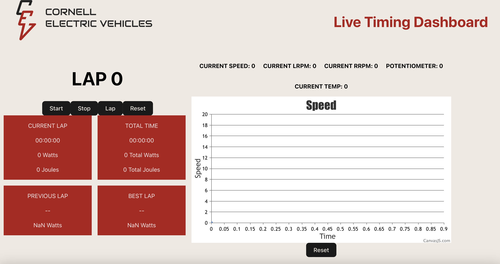

# Live Timing Dash | Spring 2024
Serena Duncan (smd334), Ruth Taddesse (ryt5), Aditya Kakade (apk67)
# Summary
## System Description
The Live Timing Dash is a ReactJS-based platform that displays information about the vehicle's performance as it runs. This dashboard is used by team members during competition to see how the car is performing and gather live data about it's performance. It is intended to provide a bridge between the driver and the rest of the team by ensuring the team is able to moniter the car during drives and ensure it is performing properly. 

The dashboard currently contains a timer that team members can operate to track the car's runs. Additionally, it displays statistics about the power, speed, voltage consumed, and other information fetched from the DAQ. Speed is additionally displayed on a live updating graph to allow members to track fluctuations and better understand each run.

The frontend of the dashboard is built in Typescript with the React framework, which uses HTML/TSX/CSS. The dashboard maintains connections with the mobile dashboard and historical dashboard through an Express server and Socket.IO.

## Terminology
**Server** : A piece of software that provides resources (such as data) on demand to the client. Handles client requests.  
**Client** : The user, the one making a request of the server.  
**Frontend** : The part of the website the user can view and interact with.  
**Backend** : The "behind-the-scenes" part of the website that handles fetching data and maintaining a connection with the server.  
**DAQ (Data Auisition system)** : A piece of hardware that collects data about the vehicle and sends it to the server.  
**Mobile Dash** : Hosted on a phone that the driver of our vehicle carries with them. Displays up-to-date information about the car and posts this information to the live timing dash.  
**React TS** : A Typescript based library that provides functionality for building front-end interfaces.  
**Components** : The building blocks of React webpages; display an element on the screen and can provide interactivity.  
**Typescript** : A type-safe version of Javascript.  
**HTML** : Stands for Hyper-Text Markup Language. The base language used to specify the layout of webpages.  
**CSS** : Stands for Cascading Style Sheets. A language that provides a way to specify the look of webpages.  
**TSX** : Allows the programmer to create HTML elements in Typescript. These elements can than be displayed in React components.  
**Vite** : A tool that helps make development of front end projects easier.  
**useEffect** : React's useEffect hook allows the user to run a piece of setup code  each time one of the specified variables (called dependcies, often connected to external systems, such as the server) changes. It runs a piece of setup code when the component is first loaded onto the page. After a dependency changes, a piece of cleanup code is run before the setup code reruns.  
**useState** : Creates a variable and a function to update its value.  
**Socket.IO** : A library that allows for data to be pushed continuously over an HTTP server.  

# How To Use
Steps:
1) [Clone the repository](https://docs.github.com/en/repositories/creating-and-managing-repositories/cloning-a-repository)
2) Install [Node.js](https://nodejs.org/en/learn/getting-started/how-to-install-nodejs) version 18+.20+
3) Navigate to main directory (LiveTimingDashTS2023)
4) Run `npm install` in terminal
5) In the terminal, run `npm start` to view site (or `npm run dev` to view developmental version)!

# Detailed System Description
## Application Architecture: Frontend
### Overview
The frontend for the live timing dash was built with React TS, which integrates TSX, CSS, and HTML to build interactive web pages. The project was built with [Vite](https://vitejs.dev/guide/). The code is split up into a variety of different files. index.html provides the webpage container for the components, which are housed in the various component files and displayed in App.tsx, which in turn is displayed in main.tsx. The .css files contain the styles used for text and colors on the dashboard. The other files contain the Websocket connection (explained the Backend section of this README) and other files necessary for creating and displaying the webpage (more information [here](https://vitejs.dev/guide/#scaffolding-your-first-vite-project))

### index.html
Provides the layout for the webpage and displays the React components.

### main.tsx
Entry point to display the App.tsx file.

### App.tsx
The App.tsx file is the primary component and acts as a container for all the other components in this project. Components are rendered in App.tsx with 
`<NameHere props\>`. 

### Component Files
The component files are the .tsx files in the src folder (excluding main.tsx, App.tsx, Socketprovider.tsx, and useSocket.tsx). These components split the interface into small, reusable blocks that each contain or handle one primary task. These components handle state changes due to data updating and display useful information about the car. Components all contain a few key elements:
1) Interface for a Data object  
This interface provides a basic layout for a data object that contains the information the component is tasked with displaying. The object is created within the component and updated periodically as new data comes in from the server.
2) Props to pass data to components that display it.  
3) a return() function  
The return function contains the TSX elements the component will display on the webpage.
4) variables for displaying data  
Variables are created with the useState hook and updated within the useEffect hook when new data needs to be displayed.

## Application Architecture: Backend
The backend allows the live dashboard to maintain a constant connection to the server, through which the dash can recieve updated information from the DAQ.

### Server.ts
This file sets up the Socket.IO server that allows the dash to push it's data to the frontend.

### Index.ts
The purpose of this file is to route data from the mobile dash to the historical dash's database. To do this, we set up an express server that contains various endpoints. Each endpoint is a POST request that routes through a different URL depending on the type of data being sent. When the mobile dash requests a certain URL, the server send the request data through to the historical dash server.

<!--### Websockets
This project utilizes the Websockets library to handle server connections. The socket is opened when the webpage starts up, and stays opne until the page closes. If the connection drops, the socket reconnects, as the dashboard always needs to maintain the connection in order to display the most up to date data. 

The endpoint for this connection has been temporarily set to a dummy endpoint that points back to the server the frontend is hosted on. Once the mobile dash and DAQ are completed, the endpoint will be set to the Mobile Dash backend. The Websocket connection is set up in SocketProvider.tsx, which ties the Websocket object to a global variable. In useSocket.tsx, this variable is turned into a React Hook that enables the programmer to quickly and easily call the socket connection anywhere it may be needed. The SocketProvider wraps all other elements in App.tsx, meaning the server only maintains one socket that is then called in all other components as needed.-->

# Challenges
<!--One of the biggest challenges with this project was having to teach myself about TypeScript and WebSockets. Typescript was fairly easy to pick up, but porting the code over ended up being very difficult due to the original code not being type safe and containing many issues with how the server connection was handled. Websockets was also a bit difficult to understand, as they were handled improperly in the old codebase and I had to figure out the proper way of setting it up. I ended up creating a useSocket() hook that allowed me to call the WebSocket connection in an easy to read way.-->
Serena: 
One of the biggest challenges with this project has been needing to teach myself the various languages and frameworks used. Learning Typescript was fairly straightforward, but I ran into difficulty trying to set up the project backend. I wasn't very familiar with how the system got data onto it's frontend, as the data currently is routed through the dash and never stored on it's servers. Figuring this out was pretty tricky and required a lot of trial and error before I found a framework that best suited this task. I realized early on this semester that Websockets would be a bit difficult to set up and lacked documentation, so ended up switching to a Socket.IO as it was easier to learn and a bit more flexible for this usage. I am not very comfortable with backend development, so setting this server up was quite a challenge but I learned a lot and am proud of my progress.
The other challenge of the project was working with the old codebase. The previous dash uses out of date React practices old database code is not well documented and very difficult to comb through, so even tasks as simple as simply seeing what information I needed to include turned into a fairly long process. I ended up deciding to do a full rewrite of the dashboard, as much of the old codebase was unusable.

# Testing
The Live Timing Dash has been tested by deploying the code to Heroku and using Postman to send dummy data to ensure all connections are functioning properly.

# Semester Work
Serena:
The primary focus of this semester was to improve the overall design of the dash to make it easier to look at, update the data to line up with what is actually recieved from DAQ, and to implement a functional backend that can send the data to the historical dash's database and display it on the Live Timing Dash's frontend. On the design end of things, I added a live updating graph that displays the current speed and rearranged the overall look of the dash with flexboxes, allowing for easier UI updates. I also added new CSS classes to improve styling for future semesters. While doing this, I added/removed components as necessary to align with the actual data that needs to be displayed. For the backend, I primarily worked on updating the connection to the frontend that would allow the data to be displayed. As stated above, this was a challenging task and took up much of the latter part of the semester (as doing research was fairly time-consuming). 

